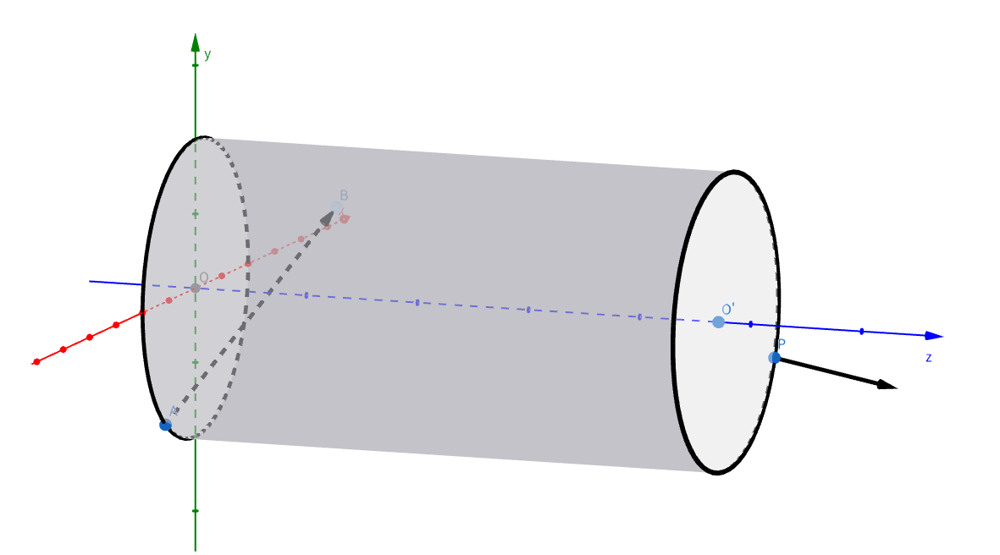

# 题目：hina的粒子实验

## 题目描述

在空间直角坐标系中，有一个横置的圆柱体通道。其底面圆心 $O$ 位于坐标系原点 $(0, 0, 0)$，底面半径为 $r$，高为 $h$。圆柱体沿 $z$ 轴正方向延伸，另一端面的圆心 $O'$ 位于点 $(0, 0, h)$。

一个粒子从圆 $O$ 上一点 $A(x_0, y_0, 0)$ 以速度 $v$ 进入。粒子在通道内做直线运动，当其撞到圆柱体的侧面（即曲面部分）时会发生完全弹性反弹：入射角等于出射角，且速率 $v$ 保持不变。

已知粒子在通道内恰好发生了 $n$ 次反弹，并在运动 $t$ 秒后，恰好从通道另一端圆周 $O'$ 上的某点 $P$ 离开。

请求出粒子第一次与侧面发生碰撞的点 $B$ 的坐标 $(x, y, z)$。由于对称性，可能会有两解，输出任意一组均可。



## 输入描述

第一行包含三个正整数 $r, h, n$，$(1 \leq r, h, n \leq 100)$分别表示圆柱体的半径、高度和粒子反弹的次数。

第二行包含三个实数 $x_0, y_0, v$，$(x_0^2 + y_0^2 = r^2, 0 < v \leq 10)$表示粒子初始位置的坐标 $(x_0, y_0, 0)$ 和粒子速度 $v$。

第三行包含一个实数 $t$，$(0 < t \leq 10)$表示粒子在通道内运动的时间。

## 输出描述

输出一行三个实数，表示粒子第一次与侧面发生碰撞的点 $B$ 的坐标 $(x, y, z)$，当与标准答案的误差在 $10^{-6}$ 以内时视为正确。若有多解，输出任意一组均可。

## 样例输入 1

```text
5 10 1
5 0 2
7.071067812
```

## 样例输出 1

```text
2.5 4.330127 5.0
```

## 样例输入 2

```text
1 1 1
0.7949830793 -0.6066316046 9.4562018458
0.1448832258
```

## 样例输出 2

```text
0.983990 -0.178225 0.5
```

## 说明

```text
对于第一组样例，有两组答案，分别为： 

$(1)$ $x = 2.5, y = 4.330127, z = 5.0$

$(2)$ $x = 2.5, y = -4.330127, z = 5.0$
​

对于第二组样例，有两组答案，分别为：

$(1)$ $x = 0.983990, y = -0.178225, z = 0.5$

$(2)$ $x = 0.431672, y = -0.902031, z = 0.5$

以上答案输出任意一组都判为正确
```
