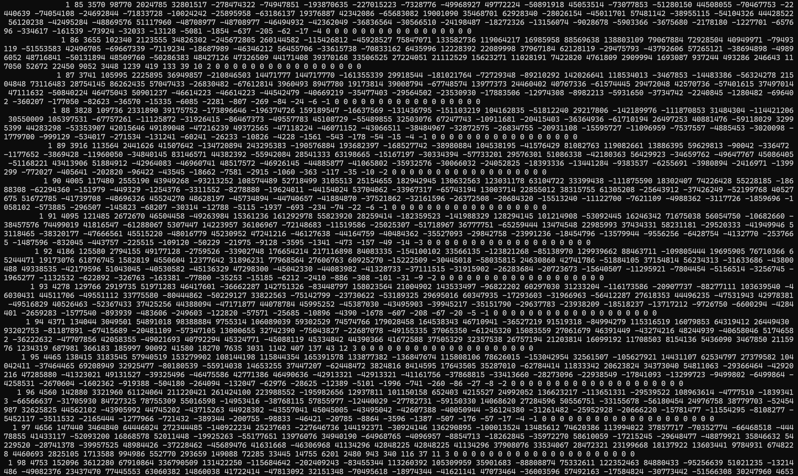

# 题目：~~杨辉海~~ 杨辉三角

## 题目描述

工作室的某位学长在他大一开学的时候被杨辉三角折磨到半夜，写出了杨辉海：


杨辉三角的性质：三角形的两条斜边上都是 $1$，其余每个数等于它肩上两数的和。
请你帮帮这位学长，打印出杨辉三角。

## 输入格式

在一行输入一个整数 $n\,(0\leq n\leq 30)$

## 输出格式

输出一组呈等腰三角形的数，满足两条斜边上都是 $1$，其余每个数等于它肩上两数的和。

## 样例输入

```text
4
```

## 样例输出

```text
   1
  1 1
 1 2 1
1 3 3 1
```
